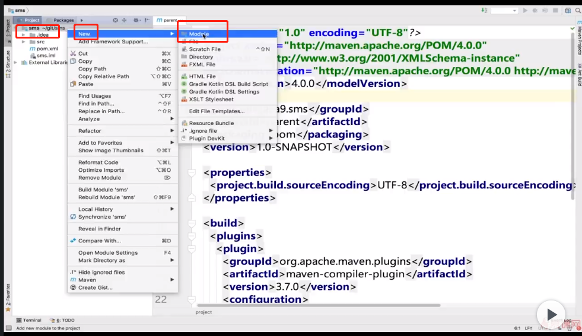

- 配置

- [pom 配置例子](https://github.com/bmuschko/whats-new-in-java-11/blob/master/pom.xml)
- 
  

  

  

``` xml
    <properties>
      <project.build.sourceEncoding>UTF-8</project.build.sourceEncoding>
    </properties>

    <build>
        <plugins>
            <plugin>
                <groupId>org.apache.maven.plugins</groupId>
                <artifactId>maven-compiler-plugin</artifactId>
                <version>3.7.0</version>
                <configuration>
                    <source>11</source>
                    <target>11</target>
                    <fork>true</fork>
                </configuration>
            </plugin>
        </plugins>
    </build>
```

## 创建 model
 

 
 
 

 

- 本地路径
 

- model Java 文件创建
 

- package 创建
 


 


 
